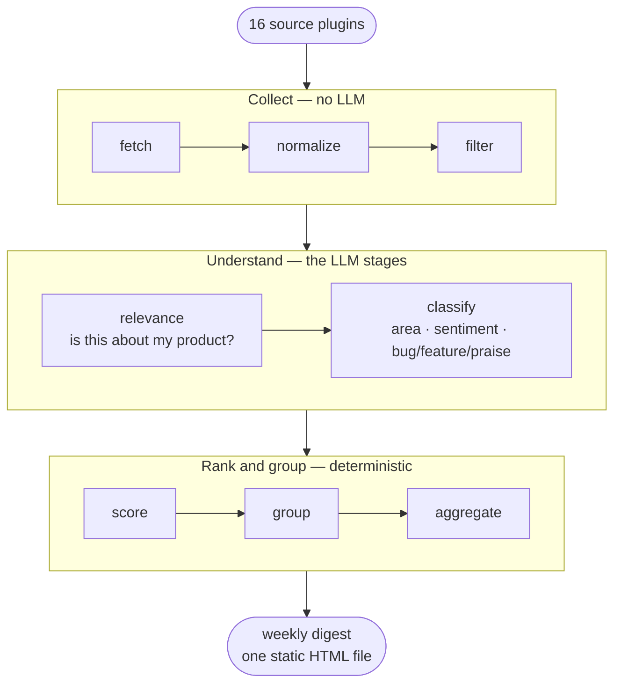

# ProductMonitor

**Find out what people are actually saying about your product — without sending a single
row of it to anyone else.**

ProductMonitor watches public feedback about any product across Reddit, Hacker News,
GitHub, app stores, forums and the tech press, uses an LLM to separate signal from noise,
and writes a static HTML digest you open in your browser. It runs on your laptop or your
own server. There is no account, no SaaS tier, and no shared database.

> ### Feedback and press coverage, as an input to product planning
>
> **Two signals, one report.** What your users say in public — Reddit threads, GitHub
> issues, app-store reviews, Discourse and Stack Exchange questions, Mastodon and Bluesky
> posts — sitting next to how the tech press is writing about you. Most teams track neither
> systematically, and the two are rarely read together even though they explain each other:
> a spike in complaints and a critical review in *The Verge* the same week are one story.
>
> **Shaped for the planning cycle, not for reading.** An LLM decides which of thousands of
> posts are genuinely about *your* product, scores sentiment and **tracks it over time per
> area of the product**, and tags every item as a **bug report, feature request, praise or
> question**. What lands in your roadmap meeting is a ranked list of themes — "conflict
> resolution: 14 items, sentiment down 0.3 over three weeks, 9 tagged as bugs" — with every
> claim linked back to the post it came from.

[](LICENSE)


<!-- SCREENSHOT: add a 1280px-wide capture of a generated digest here, and a second of the
     product dashboard. This is the single highest-value addition to this page — most
     visitors decide from the image before they read anything. Save under
     documents/screenshots/ and reference with a relative path. -->

---

## Start in one command

```bash
uvx product-monitor ui      # the admin UI at http://127.0.0.1:8766
```

That is the whole install — no venv, no clone, no signup. The UI opens on a four-screen
wizard that drafts your product profile, picks sources and proposes a taxonomy; the default
model config points at a local model, so the first run works before you have an API key.

```bash
uvx product-monitor demo    # offline sample report — no keys, no network
```

The demo replays the whole pipeline over a bundled capture of real Hacker News posts with
recorded model responses, so you can read the actual output before configuring anything.

From a checkout, or with Docker, see [documents/SETUP.md](documents/SETUP.md).

---

## What you get

A weekly digest that answers *"what happened with my product this week"* — not a list of
search results.

- **Themed sections**, not a flat feed. Items are grouped into the areas and features you
  defined, so "sync is broken again" and "conflict resolution lost my edits" land together.
- **Sentiment per area, tracked over time**, so you can see a regression appear rather than
  discovering it in a support queue.
- **Recurring issues surfaced across weeks** — the thing that keeps coming back is called
  out as such, instead of looking new every Monday.
- **Media coverage alongside user feedback**, from a built-in catalog of 21 tech and
  business publications plus any feed you add.
- **Mandatory attribution.** Every single item links back to its source. Nothing in a
  digest is unsourced, by design — it is enforced at template-validation time.

---

## Who this is for

**Product managers and founders** who want a Monday-morning read on community and press
signal, and are currently doing it by hand or not at all.

**Teams who can't use a SaaS listening tool** — because raw customer feedback can't leave
your infrastructure, or because procurement takes three months, or because the enterprise
sentiment tools start at four figures a month for a product with 200 users.

**Developers who want the data, not the dashboard.** Everything lands in DuckDB and JSONL
on your disk. Query it, pipe it, build something else on top.

**It is deliberately not**: a multi-tenant cloud product, a real-time social firehose, a
replacement for your support inbox, or a tool that watches competitors for you (except for
public app-store reviews, which it can read for any app).

---

## How it works



**Collect** is plugin work — each source knows how to page its own API and what a post
looks like there. **Understand** is where the LLM earns its cost: is this about your
product, and what is it saying. **Rank and group** is deterministic and auditable — you can
read the scoring rules and change them. The **digest** is a single static HTML file with no
server behind it.

You configure a **product** once — its name, the aliases people actually use for it, what
is in and out of scope, which sources to watch. A guided four-screen wizard drafts most of
that for you from your product's website.

Then each **run** covers a time window, typically a week. Runs are re-runnable: you can
skip the fetch stage and reuse raw data while you tune prompts, so iteration costs nothing.

Everything lives under `data/<product_id>/` and `products/<product_id>/` as plain files and
a local DuckDB file. Nothing is uploaded anywhere except the LLM calls you configured.

---

## The role of the LLM

The LLM is not doing the monitoring — the source plugins are. The LLM does the two jobs a
keyword filter is bad at:

1. **Relevance.** Is this post actually about *your* product? "Notion" matches a lot of
   things that aren't the app. This is the stage that makes the digest readable rather than
   a keyword dump.
2. **Classification.** Which area and feature does this touch, what is the sentiment, is it
   a bug report or a feature request or praise.

Those two run at volume — hundreds to thousands of items per run — so that is where cost
lives, and where you should point a cheap or local model.

A **separate assistant LLM** handles the low-volume, higher-judgement work: drafting your
product profile in the wizard, proposing a taxonomy, writing digest headlines. A handful of
calls per run, so a stronger hosted model here is affordable even when the pipeline is
local.

| | Pipeline LLM | Assistant LLM |
|---|---|---|
| **Job** | Relevance, classification | Wizard drafting, taxonomy, headlines |
| **Volume** | Hundreds–thousands of calls per run | A handful |
| **Configured** | Per product, per stage | Once, globally |
| **Sensible choice** | Cheap or local | A stronger hosted model, or the same local one |

**You can also run with no LLM at all.** Skip the relevance and classify stages and you get
a deduplicated, attributed, time-windowed feed of everything the sources found. Less useful,
but zero cost and zero data leaving the machine.

Token use and cost are tracked per run, per stage and per model, against a pricing table you
can edit — so "what did this week cost" is a number in the UI, not a surprise on a bill.

---

## Supported LLM providers

Anything that speaks the **OpenAI chat-completions API** works. Point a stage at a URL,
name a model, done.

**Hosted** — the API key is picked up automatically from `.env` based on the endpoint:

| Provider | Endpoint contains | Key |
|---|---|---|
| Anthropic | `anthropic.com` | `ANTHROPIC_API_KEY` |
| OpenAI | `openai.com` | `OPENAI_API_KEY` |
| Azure OpenAI | `openai.azure.com` | `AZURE_OPENAI_API_KEY` |
| Google (Gemini) | `googleapis.com` | `GOOGLE_API_KEY` |
| Groq | `groq.com` | `GROQ_API_KEY` |
| OpenRouter | `openrouter.ai` | `OPENROUTER_API_KEY` |
| Together | `together.ai` / `together.xyz` | `TOGETHER_API_KEY` |
| Anything else | — | set `api_key_env` explicitly |

**Local — no key, no network egress:** Ollama, Foundry Local, vLLM and LM Studio are all
recognised and need no credentials. **This is the shipped default**: out of the box the
pipeline points at a local `phi-4-mini`, so a fresh install does useful work before you have
signed up for anything.

Two provider-specific niceties are handled for you: Anthropic prompt caching is used where
it applies (the classify prompt is mostly stable across items, so this is a real saving),
and Ollama is given the JSON-object decoding path because its OpenAI-compatibility layer
doesn't enforce JSON schemas.

---

## Sources covered

16 source plugins ship built in. **Eight need no credentials at all**, which is what makes
the first run easy:

| Source | What it reads | Credentials |
|---|---|---|
| **Hacker News** | Algolia-backed search over stories and comments | None |
| **Reddit (RSS)** | Per-subreddit `/new.rss` — keyless alternative to the API | None |
| **Media coverage (RSS/Atom)** | Any feed you add, plus a built-in catalog of 21 publications: Wired · The Verge · Ars Technica · TechCrunch · Engadget · The Register · ZDNet · MIT Technology Review · IEEE Spectrum · Bloomberg Technology · Bloomberg Markets · Reuters Technology · CNBC · Windows Central · 9to5Mac · 9to5Google · Android Police · PC Gamer · MacRumors · GeekWire · Hacker News front page | None |
| **Apple App Store** | Public review feed — **any** app, including competitors, per country | None |
| **Mastodon** | Public hashtag timelines on any instance | None |
| **Microsoft Tech Community** | Community and Q&A feeds | None |
| **Discourse** | Any public Discourse forum's JSON API | Optional |
| **Stack Exchange** | Stack Overflow, Super User and siblings, by site + tags | Optional (raises quota 300 → 10k/day) |
| **Reddit (official API)** | Subreddit ingest via PRAW | Client ID + secret |
| **GitHub Issues** | Issues across a set of repos | Fine-grained PAT |
| **GitHub Discussions** | Repository discussions via GraphQL | Same PAT |
| **YouTube comments** | Keyword search, then comments and replies on the results | API key |
| **Product Hunt** | Launches and — more usefully — their comments | Token |
| **Bluesky** | Post search | Handle + app password |
| **Google Play reviews** | Reviews for **your own** apps only, ~7-day window | Service account |

Reddit, TikTok and X are also available through [ScrapeCreators](https://scrapecreators.com)
behind an off-by-default feature flag, for cases where the official APIs won't do.

**Adding a source is a plugin, not a core change.** Write one module with a `MANIFEST` and a
`Source` subclass, drop it in `plugins/`, and the UI builds its own configuration form from
your manifest — including the credential fields. Start from `plugins/example/` and the
manifest schema in `sources/base.py`. Plugins can also ship as pip-installable packages via
the `customer_feedback.sources` entry-point group.

The publication catalog is a YAML file — edit `config/media_sources.yaml` to add a trade
publication, a competitor's blog or your own changelog feed. No code change, no redeploy.

---

## Why not just use a SaaS tool, or ChatGPT?

**Versus a listening platform:** your feedback stays on your machine, you choose the model,
and the whole thing is MIT licensed. You also get to change the taxonomy, the prompts and
the scoring — they are files in your repo, not settings behind a support ticket.

**Versus pasting links into a chatbot:** repeatability. The same sources, the same window,
the same prompts, every week, with the results stored so week 12 is comparable to week 1.
Plus deduplication, engagement-weighted ranking, and attribution on every item.

**Versus a shell script and a spreadsheet:** the relevance stage. Most of what a keyword
search returns about a product is not about the product.

---

## Privacy and trust

- **No phone-home, no telemetry.** Outbound calls are exactly the source fetches and LLM
  calls you configured, and nothing else.
- **The web UI binds to `127.0.0.1` by default.** If you put it on a server, that is a
  deliberate change you make.
- **Secrets live in `.env`**, never in committed YAML.
- **Prompt-injection defences are on by default** — fetched content is fenced and labelled
  as untrusted data before it reaches a model, because you are feeding it text written by
  strangers on the internet.
- **Every rendered item carries attribution**, enforced by a template check that fails the
  build if it is missing.

---

## Status

Alpha, and honest about it. The pipeline and the digest work end to end and are in regular
use; the UI is being reworked; some features are behind off-by-default flags while they
settle. Breaking changes are possible before 1.0, and the schema is forward-only (additive
columns, no destructive migrations).

Issues and PRs welcome — particularly new source plugins, which are the part of this that
benefits most from people who care about a corner of the internet I don't use.

---

## Documentation

| Document | Read it when |
|---|---|
| [documents/SETUP.md](documents/SETUP.md) | Installing, the wizard, adding sources and LLM providers |
| [documents/ARCHITECTURE.md](documents/ARCHITECTURE.md) | You want the system diagram and the data layout |
| [documents/DESIGN_DECISIONS.md](documents/DESIGN_DECISIONS.md) | You want to know why it is built this way |

---

## License

MIT — see [LICENSE](LICENSE). Use it, fork it, run it for clients, ship it inside something
else.
